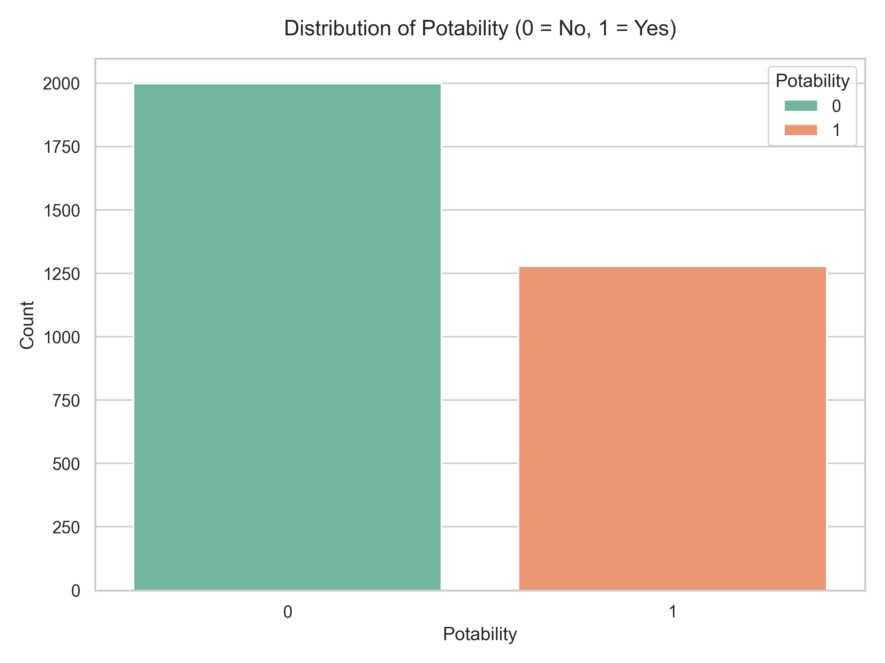
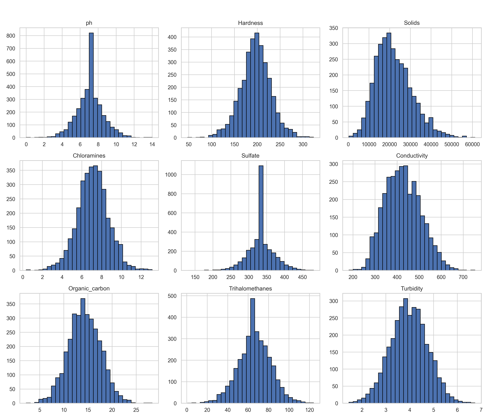
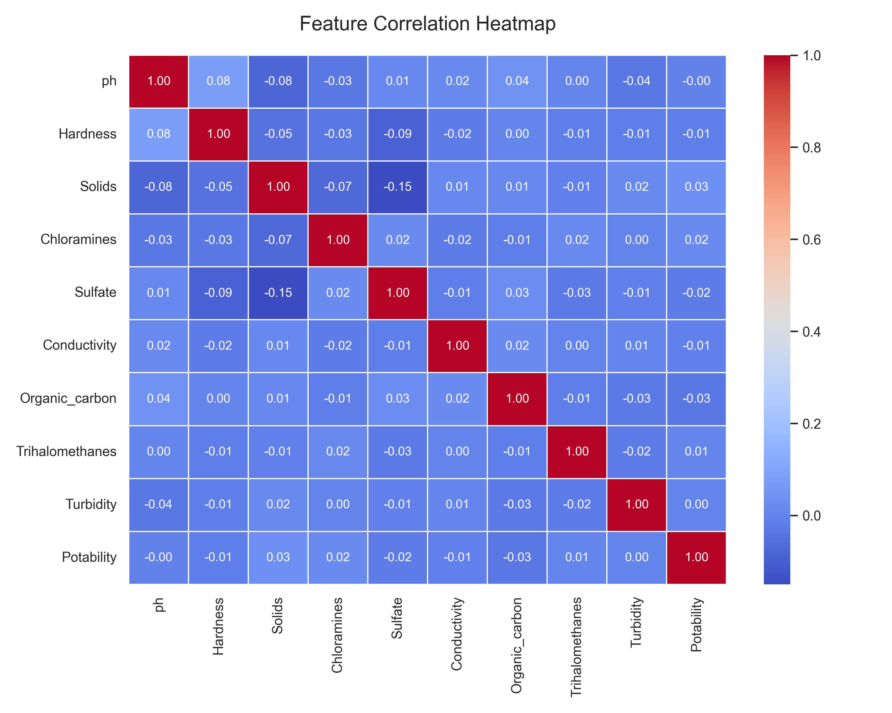
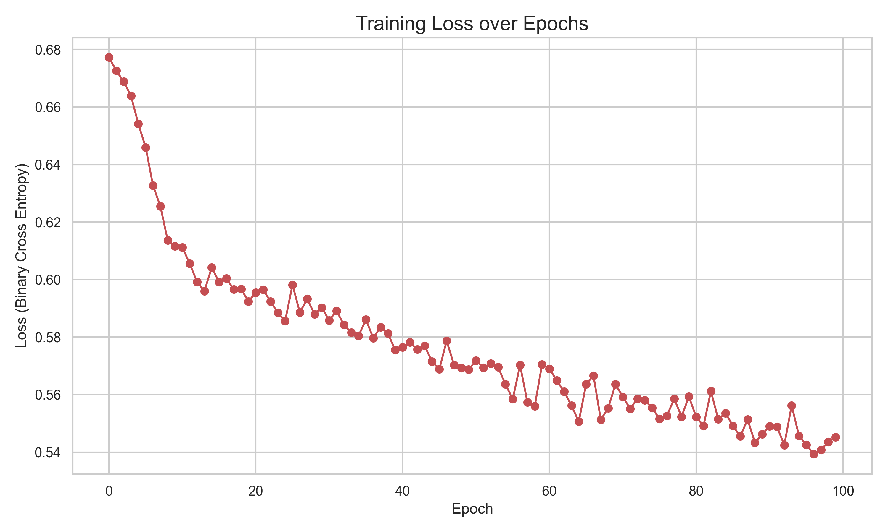
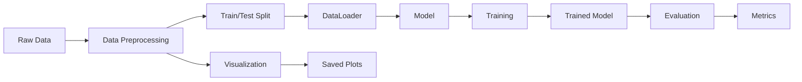

# water-potability-predictor


A deep learning project designed to effectively predict water potability based on numerous physical and chemical metrics. This repository provides a modular, easily extensible pipeline from data loading and visualization to neural network training and validation.

---


---

## Table of Contents

- [Installation](#installation)
- [Usage](#usage)
- [Features](#features)
- [Project Structure](#project-structure)
- [Tech Stack](#tech-stack)
- [Architecture](#architecture)

---

## Installation

Follow these steps to set up the project locally:

1. **Clone the repository:**
   ```bash
   git clone https://github.com/AvazAsgarov/water-potability-predictor.git
   cd water-potability-predictor
   ```

2. **Create and activate a virtual environment (recommended):**
   ```bash
   python -m venv venv
   source venv/bin/activate  # On Windows use: venv\Scripts\activate
   ```

3. **Install the dependencies:**
   ```bash
   pip install -r requirements.txt
   ```

---

## Usage

To run the complete data processing, visualization, training, and evaluation pipeline:

```bash
python main.py
```

**Expected Console Output Example:**
```text
--- Water Potability Deep Learning Pipeline ---
Data loaded and scaled successfully.
Generating exploratory visualizations in assets/...
Visualizations successfully saved.
Starting Training for 100 Epochs...
  > Epoch [ 10/100], Training Loss: 0.6116
...
=====================================
  Final Evaluation Accuracy: 67.38%
=====================================
```

You can view the newly generated insightful charts directly in the `assets/` folder. Below are some examples of the Exploratory Data Analysis and training capabilities included out of the box:

### Potability Class Balance



### Feature Distributions



### Feature Correlation Heatmap



### Training Loss Trajectory



---

## Features

- **Automated Data Processing:** Handles reading CSV files, handling missing values via imputation, applying scaling, and standardizing tensors for PyTorch.
- **Deep Neural Network:** Employs a multi-layer feedforward PyTorch neural network built effectively for binary classification.
- **Modular Design:** Segregates logical routines (models, rendering, metrics, settings) into specific configuration scripts.
- **Comprehensive Visualizations:** Produces automated, presentation-ready correlation heatmaps, feature distribution matrices, and class balance analyses using modern Seaborn themes.
- **Simple Configuration:** Hyperparameters such as learning rates, architecture depths, and batch sizes can easily be adjusted via a single `config.py` file.

---

## Project Structure

```text
water-potability-predictor/
├── assets/                 
│   ├── banner.png
│   ├── correlation_heatmap.png
│   ├── feature_distributions.png
│   ├── potability_balance.png
│   └── training_loss.png
├── data/                   
│   └── water_potability.csv
├── src/
│   ├── __init__.py
│   ├── config.py           # Global settings and hyperparameters
│   ├── dataset.py          # DataFrame manipulation and PyTorch DataLoaders
│   ├── evaluate.py         # Testing logic scripts
│   ├── model.py            # Neural Network parameter structures
│   ├── train.py            # Gradient descents and error minimization loops
│   └── visualize.py        # Static graphic rendering algorithms
├── main.py                 # Standalone script encapsulating the entire execution
└── requirements.txt        # Library and packaging dependencies
```

---

## Tech Stack

| Technology   | Purpose                                      |
|:-------------|:---------------------------------------------|
| Python       | Core programming language                    |
| PyTorch      | Neural network architecture and optimization |
| Pandas       | DataFrame structuring and imputation         |
| Scikit-Learn | Splitting and scaling features efficiently   |
| Seaborn      | Modern style heatmap and plot generation     |
| Matplotlib   | Foundational static chart engine             |

---

## Architecture

The following diagram illustrates how data flows through the application architecture during execution:


